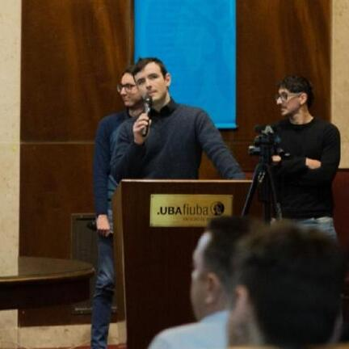

# 👨‍💻 FIUBA - Sistemas Distribuidos I - Grupo 9

Bienvenidos al espacio de trabajo del **Grupo 9** de la materia **Sistemas Distribuidos I - Roca (FIUBA)**.

Aquí centralizamos el código y la documentación de nuestros proyectos.

## 📌 Información de la materia

📍 Universidad de Buenos Aires – Facultad de Ingeniería

📚 Materia: Sistemas Distribuidos I

📅 Año: 2025

## 🎯 Objetivos de la Organización

- Desarrollar un sistema distribuido de análisis de transacciones en cadenas de cafeterías (Coffee Shop Analysis):
- Condiciones que debía cumplir:
  - Uso de un Middleware (RabbitMQ) para la comunicación entre nodos.
  - Arquitectura y diseño que permitan escalabilidad de nodos configurable e independiente entre distintas instancias de cómputo.
  - Soportar múltiples clientes en simultáneo.
  - Tolerar diversos tipos de falla, garantizando robustez y consistencia de los resultados para toda consulta realizada.

## 👥 Integrantes del Grupo 9

<table>
  <tr>
    <td align="center" width="220px">
       
      <b>Ascencio Felipe Santino</b> 
      🎓 Padrón: 110675 
      📧 fascencio@fi.uba.ar
    </td>
    <td align="center" width="220px">
       
      <b>Gamberale Luciano Martín</b> 
      🎓 Padrón: 105892 
      📧 lgamberale@fi.uba.ar
    </td>
  </tr>
  <tr>
    <td align="center" width="220px">
       
      <b>Zielonka Axel</b> 
      🎓 Padrón: 110310 
      📧 azielonka@fi.uba.ar
    </td>
    <td align="center" width="220px">
       
      <b>Papa Franco</b> 
      🎓 Corrector 
      📧 fpapa@fi.uba.ar
    </td>
  </tr>
</table>

